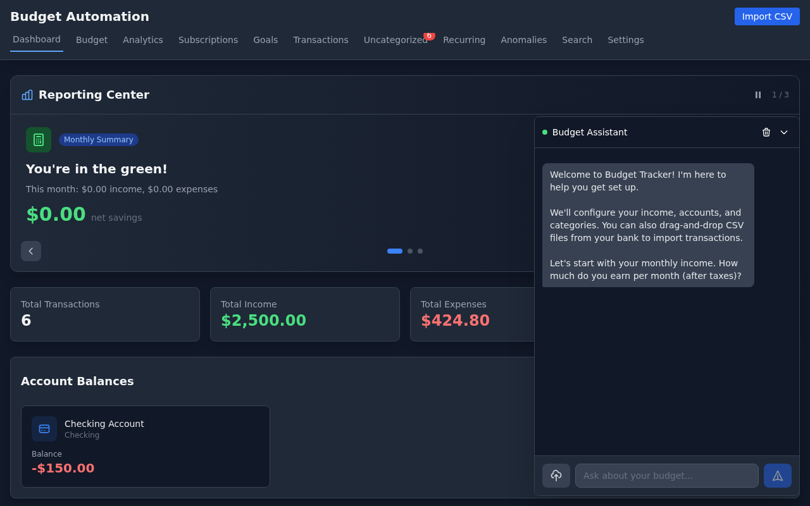
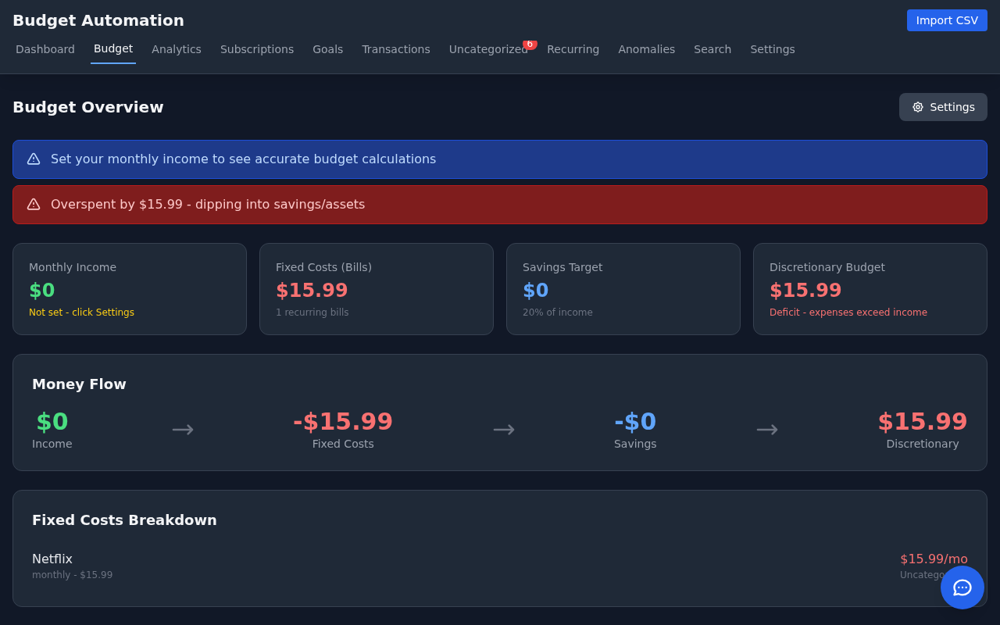
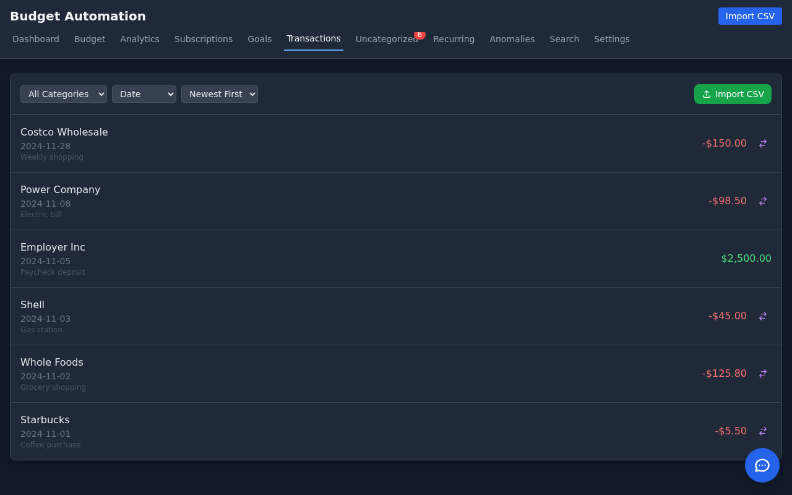
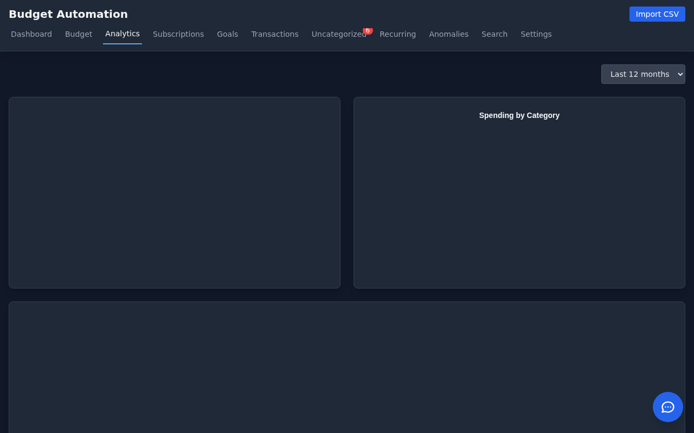
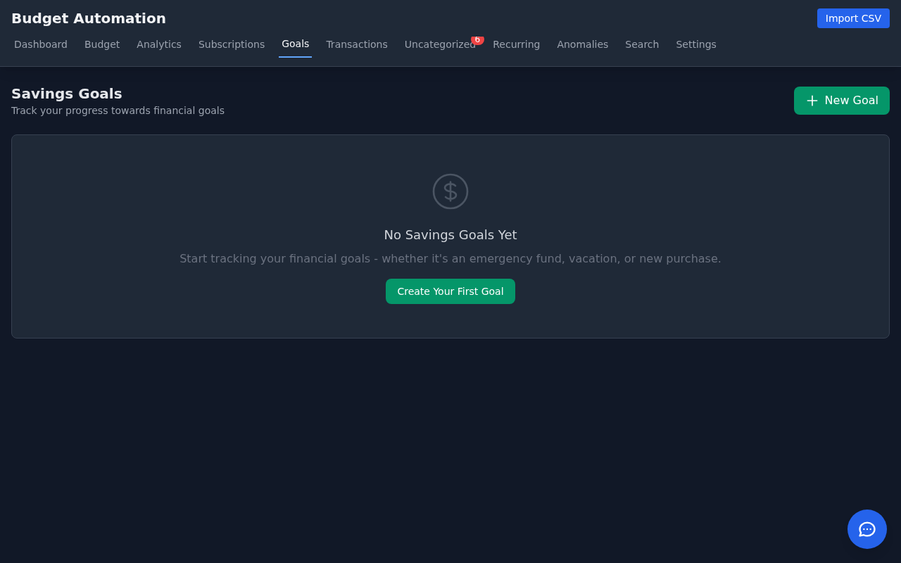
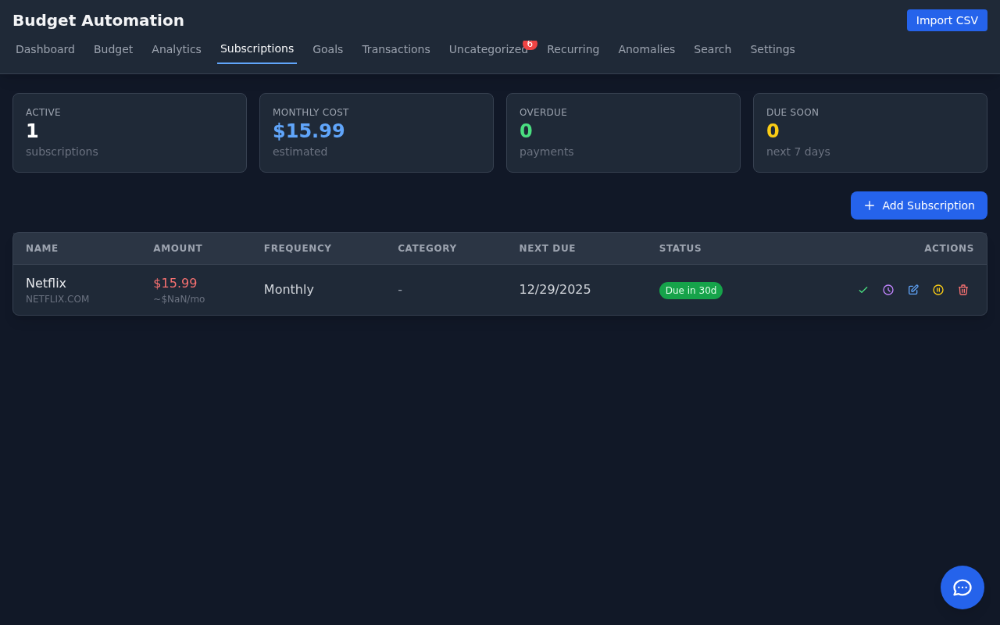

# Budget Automation

A local, privacy-first personal finance tracker with AI-powered categorization and a modern web dashboard.

## Features

### Privacy-First Design
- **100% Local Processing**: All data stays on your machine - SQLite database, local embeddings
- **No Bank API Connections**: Import transactions via CSV/Excel exports from your bank
- **Optional AI**: Claude API only used for chat assistance (never sends raw financial data)

### Web Dashboard
- **Transaction Management**: View, filter, search, and categorize transactions
- **Budget Overview**: Track spending vs. budgets by category with visual charts
- **Savings Goals**: Set targets, track progress, log contributions
- **Account Management**: Track multiple bank accounts and credit cards
- **Dark Mode UI**: Modern, responsive interface built with Alpine.js and Tailwind CSS

### AI Chat Assistant
- **Conversational Budgeting**: Ask questions about your spending patterns
- **Guided Onboarding**: AI walks you through initial setup
- **Smart Categorization**: Ask Claude to help categorize transactions
- **Create Rules**: Natural language rule creation ("categorize all Amazon as Shopping")

### Intelligent Categorization
- **RAG-Based**: Uses semantic similarity to find similar past transactions
- **Auto-Categorization**: When similar transactions agree, auto-assigns category
- **Custom Rules**: Pattern-based rules for recurring merchants
- **Bulk Operations**: Categorize multiple transactions at once

### Import & Analysis
- **Drag-and-Drop Import**: Drop CSV files directly into the chat or use the import modal
- **Auto-Detection**: Automatically detects date, amount, and merchant columns
- **Duplicate Prevention**: Smart deduplication on import
- **Recurring Detection**: Identifies subscriptions and recurring payments
- **Anomaly Flagging**: Highlights unusual transactions

## Screenshots

| Dashboard | Budget Overview |
|-----------|-----------------|
|  |  |

| Transactions | Analytics |
|--------------|-----------|
|  |  |

| Savings Goals | Subscriptions |
|---------------|---------------|
|  |  |

## Installation

```bash
# Clone the repository
git clone https://github.com/Helo3301/budget-automation.git
cd budget-automation

# Install dependencies
pip install -r requirements.txt

# Start the web server
PYTHONPATH=/path/to/parent python -m uvicorn web.api:app --host 0.0.0.0 --port 5000
```

Open http://localhost:5000 in your browser.

## Quick Start

### First Run (Onboarding)
1. Open the app - the AI chat assistant will greet you
2. Tell it your monthly income
3. Add your bank accounts (name, institution, type)
4. Customize budget categories and amounts
5. Drag-and-drop a CSV export from your bank to import transactions

### Importing Transactions
**Option 1: Drag and Drop**
- Drag a CSV file onto the chat widget
- Review the detected columns
- Click "Import & Auto-Categorize"

**Option 2: Import Modal**
- Click "Import" button in the header
- Upload your file
- Map columns if needed
- Confirm import

### Categorizing Transactions
- Click on any transaction to open it in the chat
- Ask: "What category should this be?"
- Or manually select from the category dropdown
- Create rules: "Create a rule to categorize all Starbucks as Food & Dining"

## Architecture

```
budget_automation/
├── web/
│   ├── api.py              # FastAPI REST endpoints + AI chat
│   └── static/
│       ├── index.html      # Single-page app
│       └── app.js          # Alpine.js application
├── db/
│   ├── sqlite_store.py     # Database operations
│   ├── vector_store.py     # LanceDB embeddings
│   └── schema.py           # SQLite schema
├── api/
│   └── budget_service.py   # Business logic layer
├── ingestion/
│   └── csv_parser.py       # CSV/Excel import
├── intelligence/
│   ├── embedder.py         # Local sentence-transformers
│   ├── categorizer.py      # RAG categorization
│   ├── recurring_detector.py
│   └── anomaly_detector.py
├── main.py                 # CLI interface
└── config.py               # Configuration
```

## Technology Stack

| Component | Technology |
|-----------|------------|
| Backend | FastAPI (Python) |
| Frontend | Alpine.js + Tailwind CSS |
| Database | SQLite |
| Vector Search | LanceDB |
| Embeddings | sentence-transformers (all-MiniLM-L6-v2) |
| AI Chat | Claude API (Anthropic) |
| Charts | Chart.js |

## API Endpoints

### Transactions
- `GET /api/transactions` - List transactions with filters
- `POST /api/transactions/{id}/categorize` - Categorize a transaction
- `DELETE /api/transactions/{id}` - Delete a transaction

### Categories
- `GET /api/categories` - List all categories
- `POST /api/categories` - Create a category
- `PUT /api/categories/{id}` - Update category (name, budget)

### Import
- `POST /api/import/preview` - Upload and preview CSV
- `POST /api/import/confirm` - Confirm import with column mapping

### Budget
- `GET /api/budget/settings` - Get budget settings
- `PUT /api/budget/settings` - Update monthly income, etc.
- `GET /api/budget/overview` - Spending vs budget by category

### Chat
- `POST /api/chat` - Send message to AI assistant

### Accounts & Goals
- `GET/POST /api/accounts` - Manage bank accounts
- `GET/POST /api/goals` - Manage savings goals
- `POST /api/goals/{id}/contribute` - Log contribution

## Configuration

Edit `config.py`:

```python
SIMILARITY_THRESHOLD = 0.85      # Auto-categorization confidence
TOP_K_SIMILAR = 5               # Similar transactions to retrieve
RECURRING_INTERVAL_TOLERANCE = 3 # Days variance for recurring detection
ANOMALY_IQR_MULTIPLIER = 1.5    # Sensitivity for anomaly detection
```

## CLI Usage

The CLI is still available for scripting and automation:

```bash
# Import transactions
python -m budget_automation.main import transactions.csv

# View summary
python -m budget_automation.main summary

# Search transactions
python -m budget_automation.main search "coffee"

# Categorize
python -m budget_automation.main categorize 123 "Food & Dining"
```

## Privacy & Security

- **Local-first**: All transaction data stored locally in SQLite
- **No cloud sync**: Your financial data never leaves your machine
- **No bank connections**: Manual CSV import only - no API keys to leak
- **AI privacy**: Chat messages include context but not raw transaction lists
- **Open source**: Audit the code yourself

## Development

```bash
# Run tests
python -m pytest tests/ -v

# Run with auto-reload
uvicorn web.api:app --reload --port 5000

# Run in background
nohup uvicorn web.api:app --host 0.0.0.0 --port 5000 &
```

## License

This project is licensed under the [Mozilla Public License 2.0](LICENSE).

**What this means:**
- You can use, modify, and distribute this software
- Modifications to existing files must be open-sourced under MPL 2.0
- New files (plugins, addons, extensions) can use any license, including proprietary
- Commercial addons are allowed

## Contributing

Contributions welcome! Please open an issue to discuss changes before submitting a PR.
